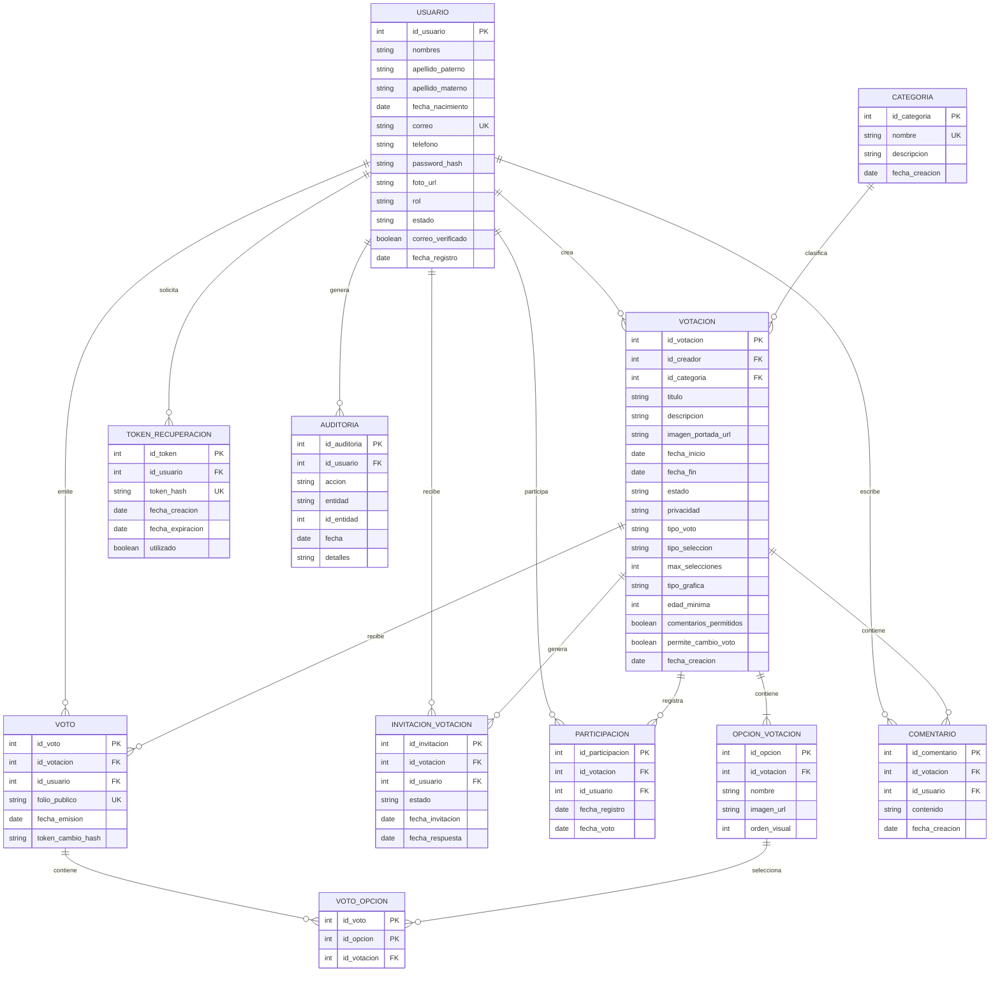

<div align="center">

# VotaYa

### Sistema Web de Gestión y Control de Votaciones

**Materia:** Programación Web

**Integrantes:**  
Enríquez Rodríguez Alejandro Guillermo  
Gómez Roblero Ángel Jahir

[Repositorio](https://github.com/AlejandroGuillermo7/VotaYa) ·
[Proyecto desplegado](https://votaya.com.mx) ·
[GitHub Projects](https://github.com/users/AlejandroGuillermo7/projects/1/views/1) ·
[Prototipo en Figma](https://www.figma.com/design/cR3nfCHOgHstbR6BejilUn/Sin-t%C3%ADtulo?node-id=0-1&t=GAFbIwEOJnfqkMnD-0)

</div>


---

## Índice

- [Descripción del proyecto](#descripción-del-proyecto)
- [Problemática que resuelve](#problemática-que-resuelve)
- [Módulos principales](#módulos-principales)
- [Roles del sistema](#roles-del-sistema)
- [Tecnologías utilizadas](#tecnologías-utilizadas)
- [Funciones principales](#funciones-principales)
- [Base de datos](#base-de-datos)
- [Instalación del proyecto](#instalación-del-proyecto)
- [Credenciales de prueba](#credenciales-de-prueba)
- [API](#api)
- [Pruebas con Bruno](#pruebas-con-bruno)
- [Despliegue](#despliegue)
- [Enlaces](#enlaces)

---

## Descripción del proyecto

**VotaYa** es una plataforma web que permite crear, administrar y participar en votaciones de forma segura, rápida y organizada.

Cualquier usuario registrado puede crear una votación, definir sus fechas de inicio y finalización, agregar opciones de voto y compartirla con otros participantes. Los usuarios emiten su voto una sola vez y consultan los resultados mediante gráficas. Dependiendo de la configuración de cada votación, el voto puede ser **anónimo** o **identificado**.

## Problemática que resuelve

Actualmente, muchas votaciones se realizan mediante formularios o métodos manuales que no garantizan un control adecuado sobre los participantes, la confidencialidad del voto ni la autenticidad de los resultados.

VotaYa ofrece una solución donde las votaciones son más seguras y organizadas: evita votos duplicados, permite controlar quién puede participar, y muestra los resultados de forma clara mediante estadísticas y gráficas.

## Módulos principales

| Módulo | Descripción |
|---|---|
| **Usuario** | Guarda los datos de las personas registradas y permite gestionar su cuenta, iniciar sesión, editar su perfil y recuperar su contraseña. |
| **Votación** | Permite crear, editar, publicar y cerrar votaciones, además de configurar fechas, privacidad y reglas de participación. |
| **Opción de votación** | Guarda las respuestas, candidatos o alternativas disponibles dentro de cada votación. |
| **Voto** | Almacena la opción seleccionada por cada participante. Según la configuración, el voto puede ser anónimo o identificado. |
| **Categoría** | Permite clasificar las votaciones según su tema (tecnología, educación, deportes, entretenimiento, etc.). |

## Roles del sistema

| Rol | Permisos |
|---|---|
| **Administrador** | Gestiona los usuarios, las votaciones y el funcionamiento general de la plataforma. |
| **Usuario registrado** | Crea y administra sus propias votaciones, edita su perfil, participa en otras votaciones y consulta resultados. |
| **Visitante** | Participa en votaciones públicas cuando la configuración lo permite, pero no puede crear votaciones. |

## Tecnologías utilizadas

**Backend:** Java · Spring Boot · Spring Security · JWT
**Frontend:** React · Vite · HTML · CSS · JavaScript
**Base de datos:** MySQL
**Comunicación:** Twilio WhatsApp · Google OAuth
**Herramientas:** Git · GitHub · Bruno

## Funciones principales

- Registro de usuarios
- Inicio de sesión con correo y contraseña
- Inicio de sesión con Google
- Autenticación mediante JWT
- Edición de perfil
- Recuperación de contraseña por WhatsApp
- Creación y edición de votaciones
- Configuración de fechas y reglas
- Votaciones públicas y privadas
- Votos anónimos o identificados
- Selección única o múltiple
- Visualización de resultados mediante gráficas
- Administración de usuarios
- Pruebas de la API con Bruno

## Base de datos

El proyecto utiliza **MySQL**, con tablas relacionadas entre sí para almacenar usuarios, categorías, votaciones, opciones, votos, participaciones, comentarios, invitaciones, tokens de recuperación y auditoría.

**Tablas principales:**

```
usuario · categoria · votacion · opcion_votacion · voto
voto_opcion · participacion · invitacion_votacion
comentario · token_recuperacion · auditoria
```

# Diagrama Entidad-Relación



## Instalación del proyecto

### Clonar el repositorio

```bash
git clone https://github.com/AlejandroGuillermo7/VotaYa.git
```

### Backend

```bash
cd votaya-backend
mvn clean spring-boot:run
```

El backend se ejecuta en:
```
http://localhost:8080
```

### Frontend

```bash
cd votaya-frontend
npm install
npm run dev
```

## Credenciales de prueba

| Rol | Correo | Contraseña |
|---|---|---|
| Administrador | jahirgomezyt3@gmail.com | 12345678 |
| Usuario | ale1111prepa7@gmail.com | 123456789 |
| Usuario visitante| sofia@gmail.com | 123456789 |


## API

**URL base:**
```
https://votaya.com.mx/api
```

**Endpoints principales:**

| Método | Ruta | Descripción |
|---|---|---|
| POST | `/api/auth/registro` | Registro de usuario |
| POST | `/api/auth/login` | Inicio de sesión |
| GET | `/api/usuarios/perfil` | Consultar perfil |
| PUT | `/api/usuarios/perfil` | Editar perfil |
| POST | `/api/votaciones` | Crear votación |
| PUT | `/api/votaciones/{id}` | Editar votación |
| GET | `/api/votaciones` | Listar votaciones |
| GET | `/api/votaciones/{id}` | Detalle de una votación |
| POST | `/api/recuperacion/solicitar` | Solicitar recuperación de contraseña |
| POST | `/api/recuperacion/restablecer` | Restablecer contraseña |

Las rutas protegidas requieren un token JWT en el encabezado:
```
Authorization: Bearer TOKEN
```

## Pruebas con Bruno

La API fue probada utilizando **Bruno**, cubriendo:

- Registro e inicio de sesión
- Obtención y uso del token JWT
- Consulta y edición de perfil
- Creación y edición de votaciones
- Consulta de votaciones disponibles
- Consulta del detalle de una votación
- Emisión de votos
- Consulta del historial de votos
- Consulta de resultados de una votación
- Consulta de categorías
- Recuperación y restablecimiento de contraseña
- Consulta de usuarios desde el panel administrador
- Eliminación lógica y reactivación de usuarios
- Administración de votaciones
- Peticiones protegidas mediante JWT
- Acceso a endpoints según el rol del usuario
- Casos de error por datos inválidos
- Casos de error por credenciales incorrectas
- Casos de error por token ausente o inválido
- Casos de acceso denegado
- Casos de recurso no encontrado

La colección se encuentra en la carpeta [`bruno-votaya`](./bruno-votaya) de este repositorio.

## Comunicación con el usuario

El sistema utiliza **Twilio WhatsApp** para enviar códigos de recuperación de contraseña.

Cuando un usuario solicita recuperar su cuenta, el backend genera un código temporal, lo asocia al usuario y lo envía al número de WhatsApp registrado en su perfil.

También se utiliza **Google OAuth** para permitir el inicio de sesión mediante una cuenta de Google.

## Despliegue

| | |
|---|---|
| **Sitio web** | https://votaya.com.mx |
| **URL base de la API** | https://votaya.com.mx/api |

## Enlaces

| Recurso | Link |
|---|---|
| Repositorio de GitHub | https://github.com/AlejandroGuillermo7/VotaYa |
| GitHub Projects | https://github.com/users/AlejandroGuillermo7/projects/1/views/1 |
| Proyecto desplegado | https://votaya.com.mx |
| Prototipo de Figma | https://www.figma.com/design/cR3nfCHOgHstbR6BejilUn/Sin-t%C3%ADtulo?node-id=0-1&t=GAFbIwEOJnfqkMnD-0 |

---

<div align="center">

**Gómez Roblero Ángel Jahir** . **Enríquez Rodríguez Alejandro Guillermo**  

</div>